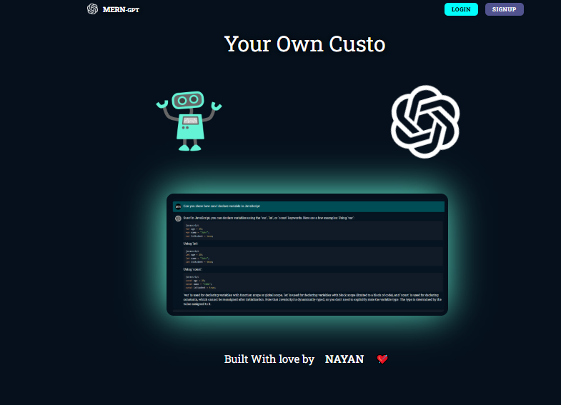

# 🤖 AI Chatbot Application

A modern full-stack AI chatbot built with **React**, **TypeScript**, **Vite**, and authentication support. The application provides a clean chat interface, user authentication, animated UI components, and seamless AI-powered conversations.



---

## ✨ Features

- 🔐 User Authentication (Login & Signup)
- 💬 Real-time AI Chat Interface
- 🎨 Modern Responsive UI
- ⚡ Built with Vite for blazing-fast performance
- 📝 Context-based State Management
- ⌨️ Typing Animation Effects
- 📱 Mobile-Friendly Design
- 🧩 Reusable Component Architecture
- 🚀 TypeScript Support
- 🌙 Clean and Professional User Experience

---

## 📂 Project Structure

```bash
chatbot/
├── public/
│   ├── airobot.png
│   ├── chat.png
│   ├── favicon.svg
│   ├── icons.svg
│   ├── neai.jpg
│   ├── nuclear.jpg
│   ├── openai.png
│   ├── robot.png
│   ├── robott.png
│   └── vite.svg
│
├── src/
│   ├── assets/
│   │   ├── hero.png
│   │   ├── react.svg
│   │   └── vite.svg
│   │
│   ├── components/
│   │   ├── chat/
│   │   │   └── ChatItem.tsx
│   │   │
│   │   ├── footer/
│   │   │   └── Footer.tsx
│   │   │
│   │   ├── shared/
│   │   │   ├── CustomizedInput.tsx
│   │   │   ├── Logo.tsx
│   │   │   └── NavigationLink.tsx
│   │   │
│   │   ├── typer/
│   │   │   └── TypingAnim.tsx
│   │   │
│   │   └── Header.tsx
│   │
│   ├── context/
│   │   └── AuthContext.tsx
│   │
│   ├── helpers/
│   │   └── api-communicator.ts
│   │
│   ├── pages/
│   │   ├── Chat.tsx
│   │   ├── Home.tsx
│   │   ├── Login.tsx
│   │   ├── NotFound.tsx
│   │   └── Signup.tsx
│   │
│   ├── App.tsx
│   ├── App.css
│   ├── index.css
│   └── main.tsx
│
├── package.json
├── vite.config.ts
└── README.md
```

---

## 🛠️ Tech Stack

### Frontend

- React 18
- TypeScript
- Vite
- React Router
- Context API
- CSS3

### Backend Integration

- REST APIs
- Authentication Services
- AI Model Integration (OpenAI or custom backend)

---

## 🚀 Getting Started

### Prerequisites

Make sure you have installed:

- Node.js (v18+ recommended)
- npm or yarn

### Installation

Clone the repository:

```bash
git clone https://github.com/Nayan-Krishna-Ball/Ai-ChatBot-Client
```

Navigate to the project directory:

```bash
cd chatbot
```

Install dependencies:

```bash
npm install
```

Start the development server:

```bash
npm run dev
```

The application will run at:

```bash
http://localhost:5173
```

---

## ⚙️ Environment Variables

Create a `.env` file in the root directory:

```env
VITE_API_URL=your_backend_api_url
```

Example:

```env
VITE_API_URL=http://localhost:5000
```

---

## 📸 Application Pages

### 🏠 Home Page

- Hero section
- AI chatbot introduction
- Navigation

### 🔑 Login Page

- User authentication
- Form validation

### 📝 Signup Page

- Account creation
- Secure registration

### 💬 Chat Page

- AI conversation interface
- Message history
- User and AI message rendering
- Typing animations

### ❌ Not Found Page

- Custom 404 page

---

## 🎨 UI Components

| Component       | Description                  |
| --------------- | ---------------------------- |
| Header          | Navigation bar               |
| Footer          | Website footer               |
| Logo            | Brand identity               |
| NavigationLink  | Reusable navigation links    |
| CustomizedInput | Styled input component       |
| ChatItem        | Single chat message renderer |
| TypingAnim      | Animated typing effect       |

---

## 🔄 Authentication Flow

```text
User
  │
  ▼
Login / Signup
  │
  ▼
AuthContext
  │
  ▼
Protected Routes
  │
  ▼
Chat Interface
```

---

## 📱 Responsive Design

The application is fully responsive and optimized for:

- Desktop 💻
- Tablet 📱
- Mobile 📲

---

## 🧹 Available Scripts

```bash
npm run dev       # Start development server
npm run build     # Production build
npm run preview   # Preview production build
npm run lint      # Run ESLint
```

---

## 🔮 Future Improvements

- Voice Input Support
- Dark Mode
- Multiple AI Models
- Image Generation
- Streaming Responses
- Markdown Rendering
- File Upload Support

---

## 🤝 Contributing

Contributions are welcome!

1. Fork the repository
2. Create a feature branch

```bash
git checkout -b feature/amazing-feature
```

3. Commit changes

```bash
git commit -m "Add amazing feature"
```

4. Push branch

```bash
git push origin feature/amazing-feature
```

5. Open a Pull Request

---

## 📄 License

This project is licensed under the MIT License.

---

## 👨‍💻 Author

**Your Name**

- GitHub: https://github.com/Nayan-Krishna-Ball
- LinkedIn: https://www.linkedin.com/in/nayan-krishna-dd/

---

<div align="center">

### ⭐ If you like this project, don't forget to star the repository!

Built with ❤️ using React, TypeScript, and AI.

</div>
